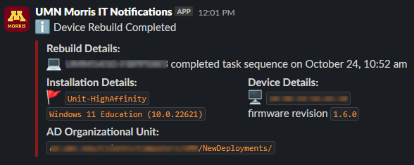

# starter-ts-slack-notifications
A "starter" set of scripts to collect and process completed Task Sequence data by sending to a Slack webhook. A resulting submission would appear similar to this image:

The [original companion blog post for this repository](https://mzonline.com/blog/2024-10/triggering-slack-notification-completion-task-sequence) explains the use case and other details behind this repository. A [second blog post](https://mzonline.com/blog/2024-11/update-direct-slack-notification-task-sequence-step) briefly discusses the more "direct" route for posting to Slack from Powershell.

## Choose Your Path
There are two ways to use this repo:
1. Via a [web host proxy](#web-hostproxy-method) (as originally designed); or
2. [Direct posting to Slack](#direct-posting-to-slack).

The proxy version has more moving parts and affords a way to perform _additional_ downstream actions due to the middleware/proxy, but the direct method is acceptable if there is only one intended use/need (push to Slack).

## Web Host/Proxy Method
### Basic Setup/Configuration
#### `www/index.php`
This script lives on a Linux/Apache/PHP host and is the "receiver" for data submitted from a workstation completing the Task Sequence. It must be reachable and respond to POST requests from devices completing a TS (internal web host) and it is _not_ recommended this host be Internet-facing as is not adequately sanitizing inputs as shared (you will want to modify the input sanitization according to your needs). Line 2 is a "salt" sort of value for additional security and must match the value of line 1 of `Submit-SlackNotification.ps1`

#### `Submit-SlackNotification.ps1`
This script is what would be invoked (by Package reference or a direct Powershell script in the step) as one of the final steps in your Task Sequence. Only lines 1 and 3 _require_ editing, but the variables in lines 17-19 are custom variables and not available by default so they need to be set or otherwise changed/removed along with their tailing references.

Edit line 1 (`$authCode`) to be a "salt" sort of value for additional security obfuscation. It must match the value of line 2 in `www/index.php`.

Edit line 3 (`$checkinUrl`) to be the FQDN to the `www/index.php` script.

#### `TSCompleteNotifier.php`
This script is invoked on a schedule (via `cron` or similar) on the web host for `www/index.php` and processes queued notification submissions, sending them to a pre-configured Slack webhook URL.

Edit line 2 (`$slackWebhookURL`) to be the FQDN for your Slack webhook.

Edit line 12 (`$channel`) to match the desired Slack notification channel.

## Direct Posting to Slack
### Basic Setup/Configuration
#### `Submit-DirectSlackNotification.ps1`
This script is what would be invoked (by Package reference or a direct Powershell script in the step) as one of the final steps in your Task Sequence. Only lines 2 and 20 _require_ editing, but the variables in lines 16-18 are custom variables and not available by default so they need to be set or otherwise changed/removed along with their tailing references.

Edit line 2 (`$slackWebhookURL`) to be the FQDN for your Slack webhook.

Edit line 20 (`$channel`) to match the desired Slack notification channel.

Invoking this in a `Run PowerShell Script` Task Sequence step should provide the same Slack notification as the multi-step process.

## Provided AS-IS
Happy to entertain improvements and suggestions, though this companion repo and blog posts were created to explain and illustrate an existing process (with additional unrelated/unexplained parts) and should not be considered a "drop in" solution for your environments.
